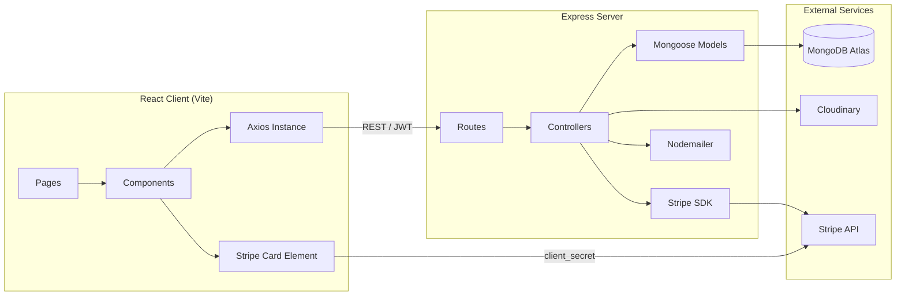

<div align="center">

# 🛍️ ShopEase

### A Full-Stack MERN E-Commerce Platform

*Browse. Cart. Checkout with Stripe. Track. Manage — all in one place.*

[](https://react.dev/)
[](https://nodejs.org/)
[](https://www.mongodb.com/atlas)
[](https://stripe.com/)
[](https://jwt.io/)

[🚀 Live Demo](https://shop-ease-eta-coral.vercel.app/) · [📦 Repository](https://github.com/mohsinshah12309/ShopEase) · [🐛 Report Bug](https://github.com/mohsinshah12309/ShopEase/issues)

</div>

---

## 📖 About

**ShopEase** is a production-grade, full-stack e-commerce platform built as the capstone project of the **Web / MERN Stack Summer Internship** at **The Tech Pulses**. It brings together everything from authentication and REST API design to real payment processing and an admin analytics dashboard — a complete, deployable online store, built entirely from scratch.

Two roles power the platform:

| Role | Can do |
|---|---|
| 🛒 **Customer** | Browse products, manage a cart, checkout with real Stripe test payments, track order history, leave reviews |
| 🛠️ **Admin** | Manage the product catalog, update order statuses, monitor customers, view revenue analytics |

No UI component libraries were used anywhere in the frontend — every card, button, badge, and layout is hand-built with plain CSS Modules.

---

## ✨ Features

- 🔐 **Role-based JWT authentication** — bcrypt-hashed passwords, customer vs. admin route protection
- 🗂️ **Product catalog** — filter by category/brand, live search, sorting, server-side pagination
- 🛒 **Persistent shopping cart** — stock-aware quantity limits, `localStorage`-backed `CartContext`
- 💳 **Real Stripe checkout** — `PaymentIntent` creation, Stripe Card Element, test-mode card payments
- 📦 **Order lifecycle** — Pending → Processing → Shipped → Delivered, customer cancellation, automatic stock decrement
- ⭐ **Reviews & ratings** — one review per customer per product, live-recalculated average rating
- 📧 **Order confirmation emails** — sent via Nodemailer after a successful payment
- 📊 **Admin dashboard** — revenue/orders/products/customers stat cards + a 6-month revenue chart (Recharts)
- 📱 **Fully responsive** — tested at mobile (375px), tablet (768px), and desktop (1280px)
- ⏳ **Polished UX** — loading states on every request, friendly error messages, disabled buttons mid-submit, disabled "Add to Cart" when out of stock

---

## 🛠️ Tech Stack

<table>
<tr>
<td valign="top" width="50%">

**Backend**
- Node.js + Express — REST API
- MongoDB Atlas + Mongoose — data layer
- JWT + bcrypt — auth & password hashing
- Stripe SDK — payment processing
- Multer + Cloudinary — image uploads
- Nodemailer — transactional email
- express-validator — request validation
- dotenv + Nodemon — config & DX

</td>
<td valign="top" width="50%">

**Frontend**
- React (Vite) — UI framework
- React Router DOM — routing & protected routes
- Context API — auth, cart & session state
- Axios — HTTP client w/ JWT interceptor
- Stripe.js / React Stripe — Card Element
- Recharts — admin revenue chart
- CSS Modules — styling, zero UI libraries

</td>
</tr>
</table>

**Deployment:** Backend on [Render](https://render.com/) · Frontend on [Vercel](https://vercel.com/)

---

## 🏗️ Architecture



---

## 🗄️ Data Models

<details>
<summary><b>👤 User</b></summary>

| Field | Type | Notes |
|---|---|---|
| name | String | required |
| email | String | required, unique |
| password | String | bcrypt hash |
| role | String | `customer` \| `admin` |
| address | Object | street, city, province, postalCode, country |
| phone | String | optional |

</details>

<details>
<summary><b>📦 Product</b></summary>

| Field | Type | Notes |
|---|---|---|
| name, description, price | — | required |
| discountPrice | Number | optional sale price |
| category | ObjectId | ref: `Category` |
| images | [String] | Cloudinary URLs |
| stock | Number | default 0 |
| ratings / numReviews | Number | auto-recalculated |
| reviews | [Object] | user, rating, comment, createdAt |
| isFeatured | Boolean | shown on homepage |

</details>

<details>
<summary><b>🏷️ Category</b></summary>

| Field | Type | Notes |
|---|---|---|
| name | String | required, unique |
| image | String | optional banner |
| slug | String | auto-generated |

</details>

<details>
<summary><b>🧾 Order</b></summary>

| Field | Type | Notes |
|---|---|---|
| user | ObjectId | ref: `User` |
| orderItems | [Object] | product, name, image, price, quantity |
| shippingAddress | Object | required |
| stripePaymentId | String | set after payment |
| itemsPrice / shippingPrice / totalPrice | Number | — |
| status | String | Pending → Processing → Shipped → Delivered → Cancelled |
| isPaid / paidAt | Boolean / Date | Stripe-confirmed |

</details>

---

## 📡 API Overview

| Resource | Base Route | Access |
|---|---|---|
| Auth | `/api/auth` | Public / Protected |
| Products | `/api/products` | Public / Admin |
| Categories | `/api/categories` | Public / Admin |
| Orders | `/api/orders` | Protected / Admin |
| Admin Analytics | `/api/admin` | Admin only |

All protected routes require:
```
Authorization: Bearer <your_jwt_token>
```

All responses follow a consistent shape:
```json
{ "success": true, "message": "...", "data": { } }
```

> 📬 Full endpoint-by-endpoint documentation lives in the project's Postman collection.

---

## 📂 Project Structure

```
ShopEase/
├── server/
│   ├── server.js
│   ├── config/          # db.js, cloudinary.js
│   ├── models/          # User, Product, Category, Order
│   ├── routes/          # auth, product, category, order, admin
│   ├── controllers/     # business logic, kept out of routes
│   └── middleware/       # authMiddleware, upload, errorHandler
└── client/
    └── src/
        ├── api/          # axios.js — JWT interceptor
        ├── context/      # AuthContext, CartContext
        ├── pages/        # Home, Products, Cart, Checkout, Orders...
        │   └── admin/    # Dashboard, Products, Orders, Users
        └── components/   # Navbar, ProductCard, CheckoutForm, etc.
```

---

## 🚀 Getting Started

### Prerequisites
- Node.js (LTS)
- A MongoDB Atlas account
- A Cloudinary account
- A Stripe account (test mode keys)

### 1. Clone the repo
```bash
git clone https://github.com/mohsinshah12309/ShopEase.git
cd ShopEase
```

### 2. Install dependencies
```bash
cd server && npm install
cd ../client && npm install
```

### 3. Configure environment variables
```bash
cp server/.env.example server/.env
```
Fill in `MONGO_URI`, `JWT_SECRET`, `STRIPE_SECRET`, your `CLOUDINARY_*` keys, and email credentials.

### 4. Run locally
```bash
# from /server
npm run dev
# from /client
npm run dev
```
- Backend → `http://localhost:5000`
- Frontend → `http://localhost:5173`

### 5. Test a payment
Use Stripe's test card:
```
Card number: 4242 4242 4242 4242
Expiry:      any future date
CVC:         any 3 digits
```

---

## 🎬 Demo Highlights

- 🧑 **Customer flow:** register → browse & filter → product detail → cart → Stripe checkout → order confirmation email → order history → leave a review
- 🛠️ **Admin flow:** dashboard analytics → create a product with image upload → update an order's status → manage customers

---

## 🔒 Security Notes

- Passwords are **never** stored in plain text — bcrypt hashing only
- `.env` is git-ignored; only `.env.example` (dummy values) is committed
- All Stripe activity uses **test mode** — no real cards or live keys
- Admin-only routes are enforced **server-side**, not just hidden in the UI

---

## 👤 Author

**Mohsin Ali Shah**
Bachelors in Software Engineering
Web / MERN Stack Summer Internship — The Tech Pulses (2026)

- GitHub: [@mohsinshah12309](https://github.com/mohsinshah12309)

---

<div align="center">

**⭐ Built as a capstone project — from an empty folder to a fully deployed store.**

</div>
